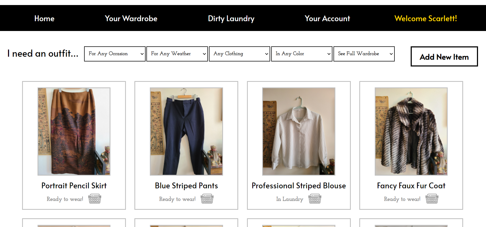

<p align="center">

</p>

<h1 align="center">Bienvenue à Antoinette - Reign Over Your Wardrobe</h1>

<p>Antoinette is a wardobe organizing application giving users a bird's eye view of their closet. By uploading personalized profiles of each piece they own, users
  can plan new outfits, notice ways to build out their collection, and find the clothes they never wear. This app makes it easy to dress for any weather or occasion.</p>
<p>This application was orginally built as my Phase 5 Capstone Project at the Flatiron School Software Engineering Bootcamp, though as a passion project I continue to update it from time to time.</p>

**Made With:** 

<a href="https://developer.mozilla.org/en-US/docs/Web/JavaScript" target="_blank" rel="noreferrer">  </a> 
  <a href="https://reactjs.org/" target="_blank" rel="noreferrer">  </a> 
  <a href="https://www.ruby-lang.org/en/" target="_blank" rel="noreferrer">  </a>
   <a href="https://rubyonrails.org" target="_blank" rel="noreferrer">  </a> 
    <a href="https://www.postgresql.org" target="_blank" rel="noreferrer">  </a>

## Technical Accomplishments

* Implemented Rails Active Storage to capture user image submissions, stored data in a relational PostgreSQL database, and display the image via a URL source. 
* Added bcrypt user authentication to facilitate account creation, securely pass sensitive information, set protected cookies allowing for persisting user login, and ` validate login status to access certain application features.
* Employed Flexbox CSS to build a full UI from scratch, style React components and page elements. 

## Demo and Images
[Watch the full video demo here!](https://www.youtube.com/watch?v=7RJcjQI0iow)



## How to Run This Application:
* Install Ruby Gems with via the "Bundle Install" command
* Install required NPM nodes with the command "npm install --prefix client"
* Run the following commands in two seperate terminals:

```
// start the server
rails s 
```

```
// start the frontend interface
npm start --prefix client 
```

Developed by: 
* [Scarlett Eller](https://github.com/ScarlettEller1715) 
